# Basic softwares installation
Lists the softwares any new member of MPG Partners might need and details the installation process.

# Direct installations
We recommend downloading the following softwares :
*  [R](https://www.r-project.org): use any CRAN mirror for download
*  [RStudio](https://rstudio.com): see the download link, then choose the free version
*  [MiKTEX](https://miktex.org): see the download tab
*  [Everything](https://www.voidtools.com/downloads/)
*  [GitHub Desktop](https://desktop.github.com)
* 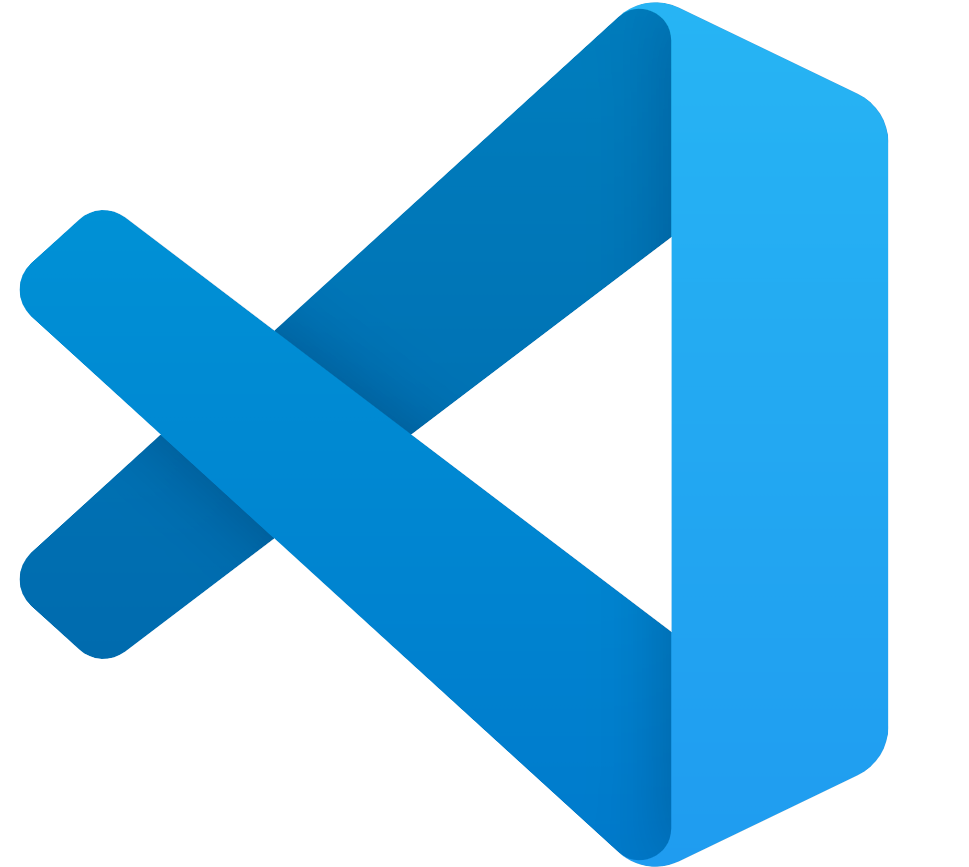 [Visual Studio Code](https://code.visualstudio.com)

Those installations should be fine using the latest (64 bits) version and the default settings for each software .
In case some issues are encountered, here are the detailed versions used as of January 2021 :
* R : [4.0.3](https://cran.rstudio.com)
* RStudio: [1.4.1103](https://rstudio.com/products/rstudio/release-notes/)
* Miktex: [21.1](https://miktex.org/download)

# 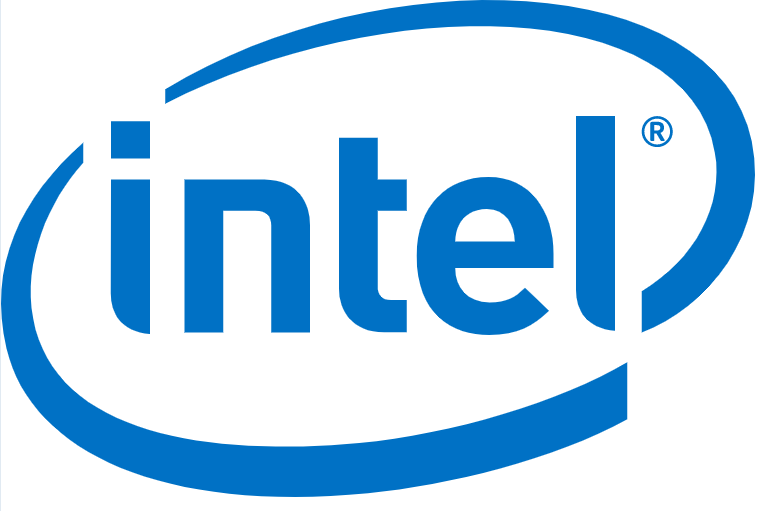 [Intel® oneAPI Math Kernel Library]
Codpy uses math tools from the [Intel® oneAPI Math Kernel Library](https://software.intel.com/content/www/us/en/develop/articles/oneapi-standalone-components.html#onemkl).
Make sure you only download the MKL component, as such :

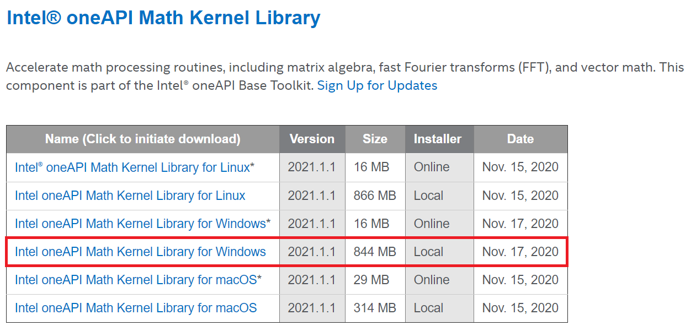

# 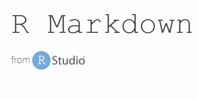 RMarkdown
Once R and RStudio are installed, open the latter.
In the console, enter "*install.packages("rmarkdown")*" to install [RMarkdown](https://rmarkdown.rstudio.com/index.html).

# 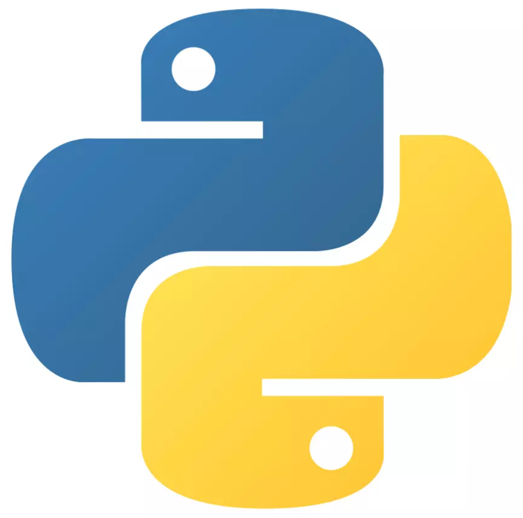  Python

## Installation
First, download [Python 3.7.7](https://www.python.org/downloads/release/python-377/) (select *Windows x86-64 executable installer*).

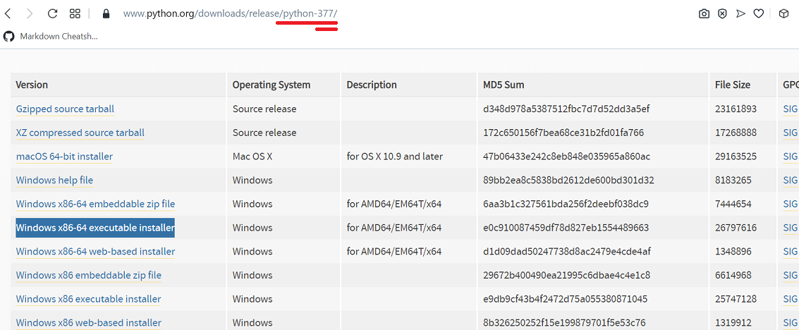

Choose the customized istallation, and in the custom parameters :
* install Python "at the root" : ("*C:\Python*")
* make sure to "*add Python to the PATH*"
* make sure pip will be installed by typing: "*pip*"

## Librairies
Open the command prompt (*invite de commande*) by typing "cmd" in the Windows search bar.
Then :
* you can check that pip is installed by typing "*pip*"
* install pandas by typing: "*pip install pandas*"
* install numpy by typing: "*pip install numpy*" (might indicate that numpy is already installed)
* install matplotlib by typing: "*-m pip install -U matplotlib*"
Don't hesitate to use *Everything* to check if "pandas", "numpy" and "matplotlib" are installed (just look for their names and make sure *Everything* finds some files).

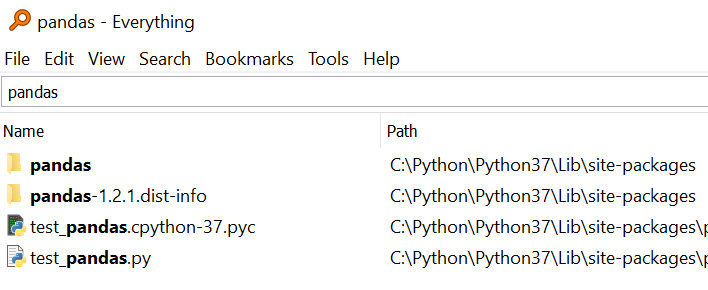

## GitHub & Codpy

By now, you should have received an invitation to join the team repository (from Jean-Mark a.k.a JohnleM).

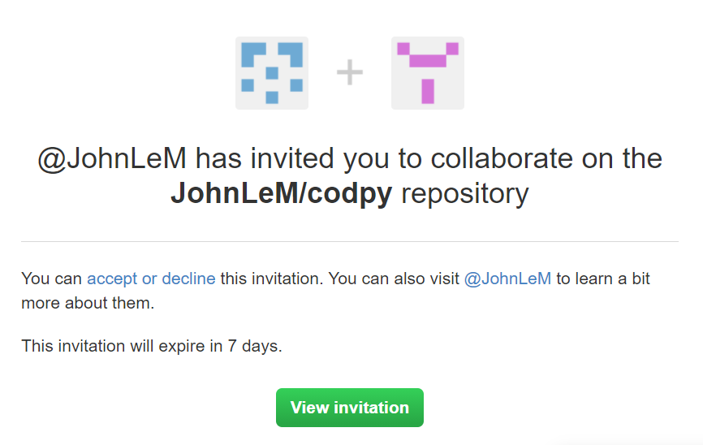

View the invitation : this will open a github tab.
Click on code, and choose to open with GitHub Desktop.

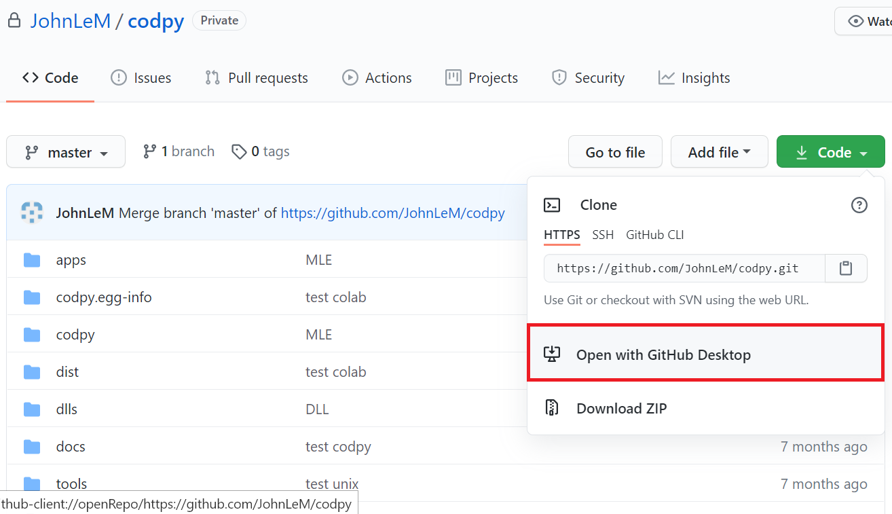

You are now on GitHub Desktop. 
* First, one crucial point : **DO NOT EVER HIT "commit to master" IF YOU'RE NOT UNDER JEAN-MARC SUPERVISION !**
* That said, select *Fetch origin* : you should now be able to "clone" codpy on the repository you want. We recommend opening a codpy file in your Documents, and cloning in it, but it's you choice.

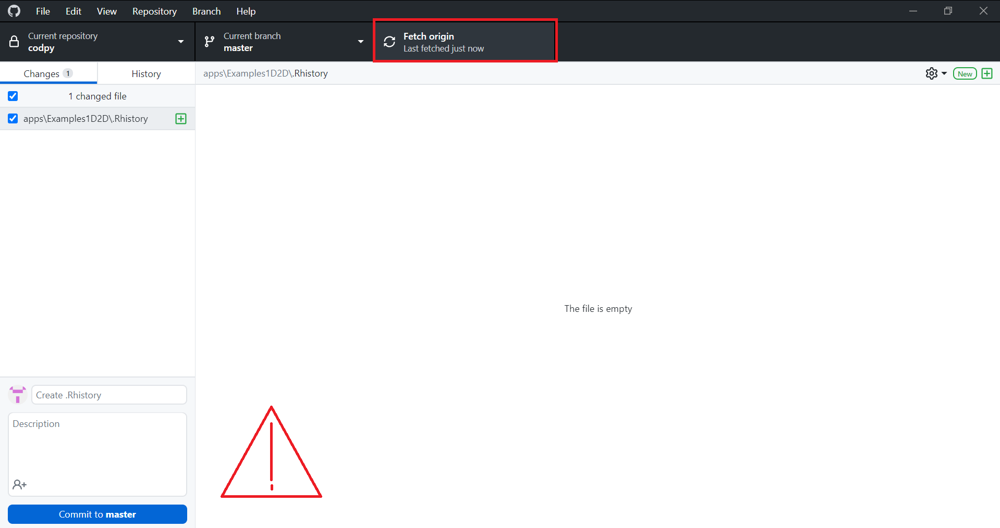

Then :
* Access *codpy>codpy* : you will find two "codpy" files. Copy both of them.
* Find the python directory (you can look for *python.exe* in the Everything software) and access the "site-packages" file. Path shoud be *Python>Python37>Lib>site-packages*
* Paste the two copied files.

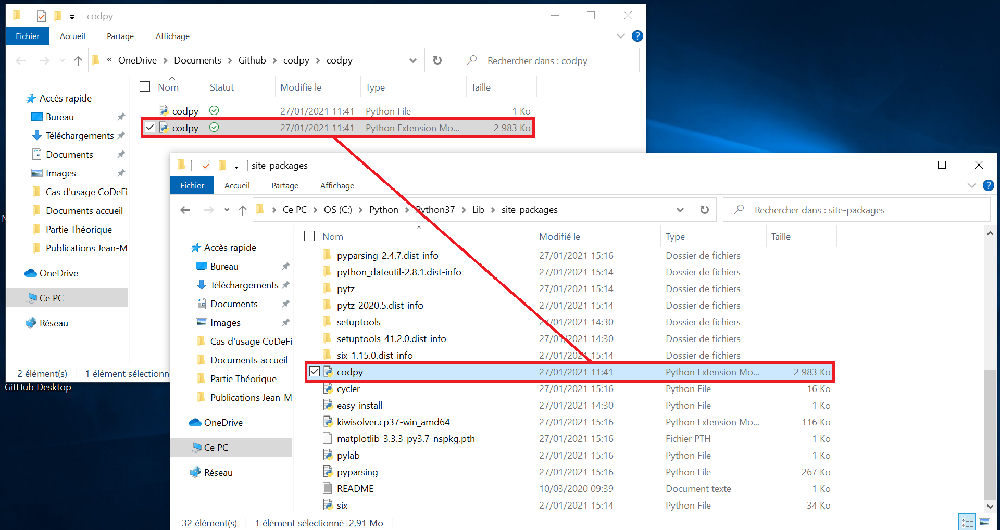

## Environment variables
We now need to update the environment variables.
* In the Windows search bar, look for "*Modifier les variables d'environnement*" (typing "environment" or "variable" should suffice)
* In the new window, select "Environment variables"

Now, in the second frame ("*System variables*"), create two new variables :
* Call the first one "*PYTHONHOME*" with value "*C:\Python\Python37*"
* Call the second one "*PYTHONPATH*" with three different values (you can either separate the paths with a semicolumn, or add them separately) :
    *-"*C:\Python\Python37\DLLs*"
    *-"*C:\Python\Python37\Lib*"
    *-"*C:\Python\Python37\Lib\site-packages*"
    
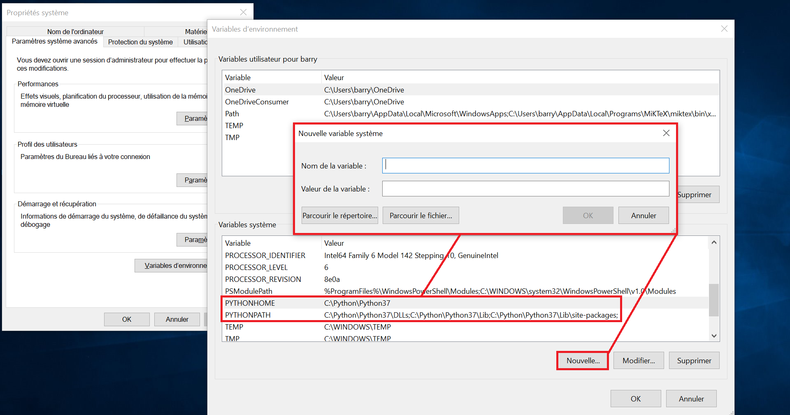

Select the "*Path*" variable and add the values :
* "*C:\Python\Python37*"
* "*C:\Program Files (x86)\Intel\oneAPI\mkl\2021.1.1\redist\intel64*"
* "*C:\Program Files (x86)\Intel\oneAPI\compiler\2021.1.1\windows\redist\intel64_win\compiler*"
* "*C:\Users\barry\OneDrive\Documents\codpy\codpy\dlls*"
      
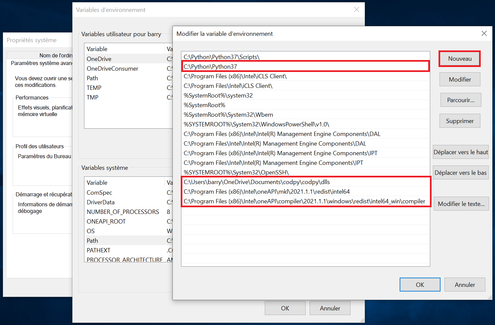

Finally, open Everything and look for the "*mkl_rt.1.dll*" dll file. You should find it in the *C:\Program Files (x86)\Intel\oneAPI\mkl\2021.1.1\redist\intel64* folder.
Copy it, and paste it in the dll folder in codpy : *codpy\codpy\dll*.

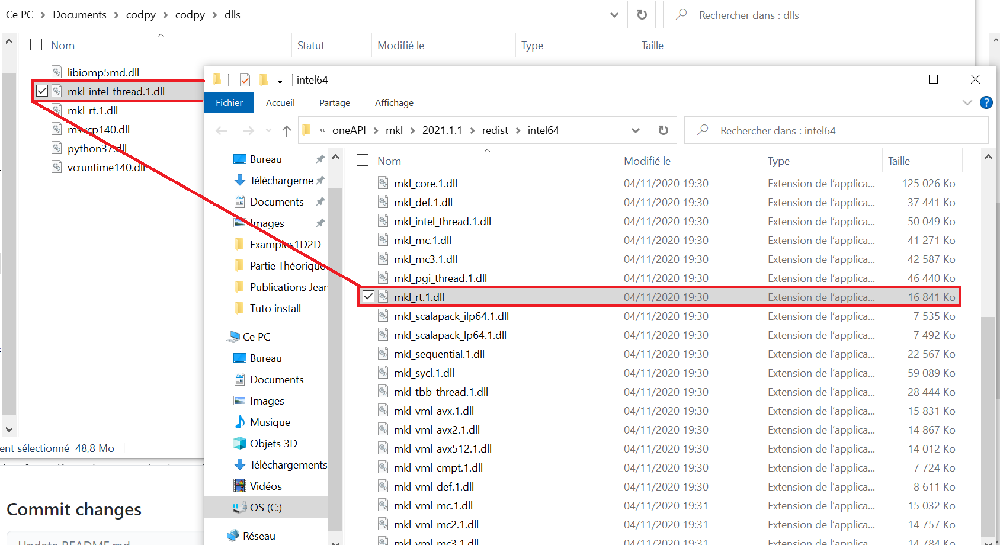

Close all windows.

# Testing with Visual Studio Code

You can now check the installation worked.
With Visual Studio Code, open the *Example1D2D.py* file found in the *\codpy\codpy\apps\Examples1D2D* folder.

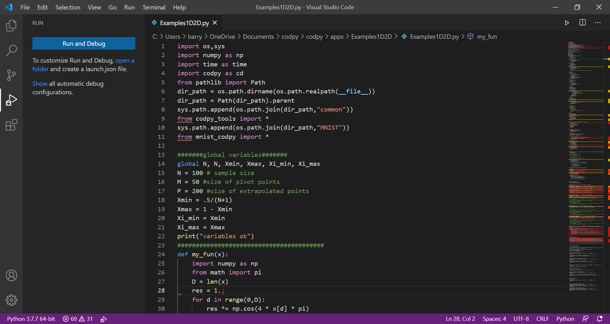

Hit F5, then "Python File - Debug the currently active Python file", or just Ctrl + F5.
If everything works, you should have this output :

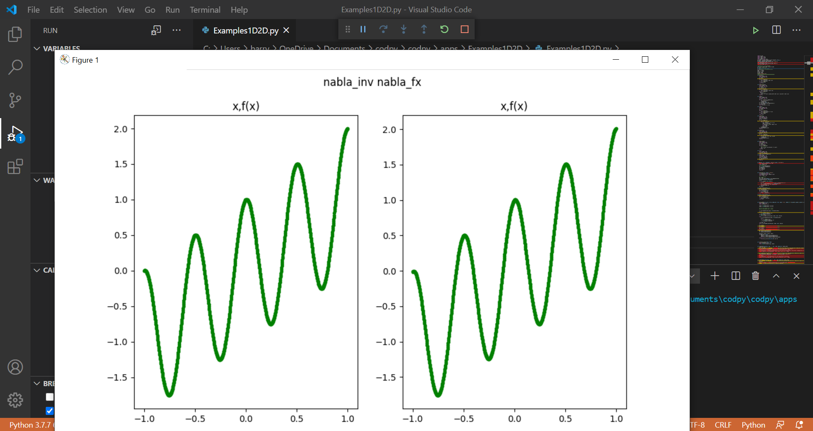

Close all windows.
